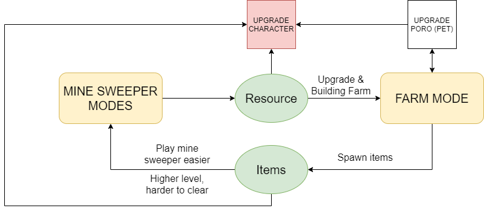

**🎮️ Name of the game:** Poro - Mushroom Sweeper

**👥 Member:**
* Design: anhtp996
* Artist: anhtp996
* Dev: anhtp996
* QA: anhtp996

# Why I make this game
I wanna:
* Bring my feeling when I first time discover how to play minesweeper for people who never play/hear/know how to play it before.
* Bring something new, something more satify, comfortable feeling for those who love to play minesweeper
* Personal stuff: Learn to making games (from designing, drawing, coding, testing, bring it to the right players), earn some money

# Content
1. Minesweeper normal mode
2. Adventure mode
3. Endless mode
4. Events
5. Poro farm
6. Pet system
7. Skill system
8. Items
9. Upgrade items system

# Overview
**Poro - Mushroom Sweeper** 

## Main concept
Minesweeper + RPG + Farm

## Player role
Player is a hero try to fight with evil rescure Poro

## Final Goal
Upgrade the character

## Unique selling point
1. Poro farm (compare to other RPG minesweeper games)
2. Combat action (with skill system) (compare to other minesweeper games)
3. Cool map (environment) - change when clearing map (Ex. Snow, Forest, Sea, etc.)

## Game modes
1. Minesweeper: Normal (clear map to get XP, coins, resource), Adventure (clear map to explore more map, chapter to chapter), endless map, Event (clear every 2 or 3 days)
2. Build & Upgrade Base (Poro farm)

## Core loop

## Target audience
* Player who love to play minesweeper
* Puzzle game player
* Player who love cute character/animal (cat, poro, etc.)
* Offline PRG players

## Genre
* Puzzle
* Action
* RPG

## Art style
Cartoon, square block (Bom online, Achero)

## Monetization
* IAP: Buy gem, items, remove ads, offers, skin
* Ads: Revived, energy, free coins, items

## Target platform
Mobile: Android, IOS

## Engine
Cocos2dx (C++)

## Reference
### [Minesweeper][1]

**Download:** 10M+

**Rating:** 4.47

**Revenue:** ???

**Gameplay & Features:**
 * Classic minesweeper: mode with only one time bomb click (1 life/game) and mode with more bomb click (more life in a game)
 * Score: Play time
 * Hint: Watch an ad to get hint, all boom will be shown in a couple of seconds and then hide (Player need to remember them)
 * Daily challenge: Complete daily challenge -> get medal for month when complete xxx days/month

**Art style:** Classic minesweeper (ingame), flat app (menu scene)

**Monetization:**
* Ads: Hint, 
* IAP: Vip packs (no ads, bonus games, repair broken streak - miss a daily challenge)

**To-improve:**
* Button back
* Nothing happen when player failed

### [Minesweeper for Android - Free Mines Landmine Game][2]

**Download:** 1M+

**Rating:** 4.7

**Revenue:** ???

**Gameplay & Features:**
 * Classic minesweeper gameplay
 * Score: Play time
 * Leaderboard: Global, player's country (by level: beginner, easy, intermediate, expert), enter player's name first time finish a game **(No login required)**
 * Local high score

**Art style:** Classic minesweeper (ingame), flat app (menu scene)

**Monetization:**
* Ads: When player failed, open Leaderboard

**To-improve:**
* Not full screen map (need to scroll)
* Nothing happen when player failed

### [Minesweeper - The Clean One][3]

**Download:** 100K+

**Rating:** 4.4

**Revenue:** ???

**Gameplay & Features:**
 * Classic minesweeper gameplay with level (easy, hard, ...)
 * Score: Play time
 * Ranking: Global, player's country (by level: beginner, easy, intermediate, expert), enter player's name first time finish a game **(No login required)**
 * Local high score

**Art style:** Flat, clean (can change color theme), cool animation(start game, end game)

**Monetization:**
* Ads: When player failed, open ranking layer 
* IAP: Remove ads, more theme

### [Zombie Sweeper: Minesweeper Action Puzzle][4]

**Download:** 100K+

**Rating:** 4.2

**Revenue:** ???

**Gameplay & Features:**
 * Find zombie in map (with minesweeper rule), deploy troop to kill zombie, kill all zombies -> clear map -> next level (chapter)
 * Turn: Each game player have limit turn to open cell or summon troops (like turn in math 3)
 * Has tutorial
 * Shop: coins, energy, no ads
 * Leaderboard
 * Achievement
 * Open chest
 * Energy: Play a game will spent 1 energy (regen by time or buy with coins)
 * Quest:
 * Coins: Used to by energy
 * Clear map reward: Coin, energy

**Art style:** 3D, zombie, cartoon

**Monetization:**
* Ads: Get free energy, coins
* IAP: Remove ads, buy coins, energy

### [Minesweeper JAZZ][5]
**Overview:** Minesweeper + Math3 (leveling, special effect, in-game items - boosters)
**Download:** 10K+

**Rating:** 4.4

**Revenue:** ???

**Gameplay & Features:**
 * Overview: 
 * Leveling with 3 star (like math3): Higher level bigger map size (when user clear a part of the map, it will fall down (like [Brick Puzzle][https://play.google.com/store/search?q=brick%20puzzle&c=apps])
 * Cell with special effect (like math3)
 * Features: Wheel, Chest (collect star to open)
 * Boosters: Open a/some cell(s) or flag it (if it is a bomb)
 * Life: Tap on bomb -> lose a life (life refill after 30min - like math3)
 * Tap on bomb -> user can revive using coins
 * Reward: Star, new level
 * Leaderboard: Score by level
 * Chest: Open chest to get coin or boosters, Chest can be obtained by using star
 * Hint when idle
 * Facebook login
 * Tournament: score by star
 * Wheel: Normal wheel (Reach level xxx to spin), Golden wheel (Pay to spin)

**Art style:** cartoon

**Monetization:**
* Ads: Get free energy, coins
* IAP: Remove ads, buy coins, energy

### [Minesweeper GO - classic mines game][6]

**Download:** 500K+

**Rating:** 4.47

**Revenue:** ???

**Gameplay & Features:**
 * Classic minesweeper
 * Setting: Customize tap experiment
 * Campaign: Leveling (clear map to unlock more level) - level is define by map size (and maybe No. bombs)

**Art style:** Classic minesweeper (ingame), flat app (menu scene)

**Monetization:**
* Ads: Only in Menu (no ads when user play)
* IAP: Vip packs (no ads, bonus games, repair broken streak - miss a daily challenge)

[1]: https://play.google.com/store/apps/details?id=Draziw.Button.Mines
[2]: https://play.google.com/store/apps/details?id=com.panu
[3]: https://play.google.com/store/apps/details?id=ee.dustland.android.minesweeper
[4]: https://play.google.com/store/apps/details?id=com.arcgamestudio.zombiesweeper
[5]: https://play.google.com/store/apps/details?id=com.gs.msjazz